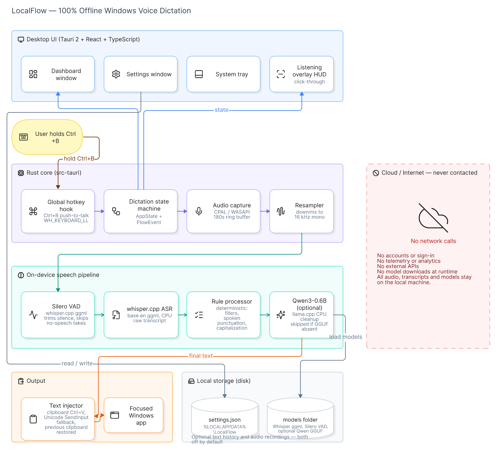

<p align="center">
  
</p>

<h1 align="center">LocalFlow</h1>

<p align="center">
  <strong>Offline voice dictation for Windows.</strong><br />
  Speak anywhere. Text stays on this PC. Nothing is sent to the cloud.
</p>

<p align="center">
  <a href="https://github.com/HimanshuMohanty-Git24/LocalFlow/actions/workflows/ci.yml">
    
  </a>
  <a href="https://himanshumohanty-git24.github.io/LocalFlow/">
    
  </a>
  <a href="https://github.com/HimanshuMohanty-Git24/LocalFlow/releases/latest">
    
  </a>
  <a href="https://github.com/HimanshuMohanty-Git24/LocalFlow/releases">
    
  </a>
  <a href="LICENSE">
    
  </a>
  
  
  
  
  <a href="https://github.com/HimanshuMohanty-Git24/LocalFlow/stargazers">
    
  </a>
</p>

<p align="center">
  <a href="https://himanshumohanty-git24.github.io/LocalFlow/"><strong>Download for Windows</strong></a>
  ·
  <a href="docs/install.md">Install guide</a>
  ·
  <a href="docs/privacy.md">Privacy</a>
</p>

---

LocalFlow is a desktop dictation app: hold a hotkey, speak, and cleaned text is pasted into the focused window. Recognition runs with **whisper.cpp** on-device. Optional punctuation cleanup can use a local **Qwen** GGUF. There is no account, no telemetry, and no network call for speech.

## Demo

<video src="https://github.com/HimanshuMohanty-Git24/LocalFlow/raw/main/docs/assets/localflow-demo.mp4" controls width="100%"></video>

If the player does not load, [download the demo](docs/assets/localflow-demo.mp4).

## Features

- **Fully offline** — audio, transcripts, and clipboard never leave the machine
- **Push-to-talk** — hold `Ctrl+B`, speak, release
- **Long listen** — press `Ctrl+B` twice; stop with Space or Esc
- **System tray** — stays out of the way; quit from the tray menu
- **Current-user installer** — NSIS `.exe`, no admin required
- **Whisper included** — `base.en` plus Silero VAD ship in the installer
- **Optional local LLM** — drop in Qwen for extra cleanup; rules still run without it

## Install

1. Download from the [product site](https://himanshumohanty-git24.github.io/LocalFlow/) (always the latest NSIS `.exe`) or from [Releases](https://github.com/HimanshuMohanty-Git24/LocalFlow/releases/latest).
2. Run the installer (your user only — no administrator prompt).
3. If Windows SmartScreen warns that the app is unsigned, choose **More info** → **Run anyway**.
4. Click a text field, hold **Ctrl+B**, speak, release.

Full first-run steps, including optional Qwen: [docs/install.md](docs/install.md).

## Usage

| Action | How |
| --- | --- |
| Short dictation | Hold `Ctrl+B` (≥ ~280 ms), speak, release |
| Long dictation | `Ctrl+B` twice, speak, then Space or Esc |
| Hide window | Close the dashboard (app stays in the tray) |
| Quit | Tray icon → **Quit** |

Silence is skipped. Built-in rules clean fillers, punctuation, times, and vocabulary before paste.

## Optional Qwen (AI cleanup)

The installer does **not** include Qwen (~610 MB). Dictation works without it.

1. Create `%LOCALAPPDATA%\LocalFlow\models`
2. Download [`Qwen3-0.6B-Q8_0.gguf`](https://huggingface.co/Qwen/Qwen3-0.6B-GGUF)
3. Copy the file into that folder (filename must contain `qwen`)
4. Quit LocalFlow from the tray and reopen it
5. Keep **AI cleanup with local Qwen (offline)** enabled in Settings

Needs about 8 GB RAM. Details: [docs/install.md](docs/install.md) and [docs/models.md](docs/models.md).

## Privacy

No accounts. No cloud APIs. No OpenAI. No Ollama requirement. No Python runtime in the shipped app. Dictation audio stays in memory unless you explicitly enable saving; text history is also off by default. Neither is ever written to logs.

See [docs/privacy.md](docs/privacy.md).

## Architecture

<p align="center">
  
</p>

Hotkey → capture → VAD → whisper.cpp → rule cleanup → optional Qwen → paste into the focused app. Models and settings live on disk; nothing crosses the network. Details: [docs/architecture.md](docs/architecture.md).

## Development

Requires Windows 10/11 x64, Node.js 20+, Rust (MSVC), VS 2022 C++ Build Tools, CMake, LLVM/Clang, and a Whisper ggml file in `models/` for dictation tests.

```bash
npm install
npm run test:rust
npm run tauri dev
```

Verbose logs:

```powershell
$env:LOCALFLOW_LOG = "debug"
npm run tauri dev
```

`main` only accepts pull requests. CI must pass. New installers are built by tagging `v*` (for example `git tag v0.1.3 && git push origin v0.1.3`).

More: [CONTRIBUTING.md](CONTRIBUTING.md), [docs/architecture.md](docs/architecture.md).

## License

[MIT](LICENSE) © 2026 LocalFlow

## Star History

[](https://www.star-history.com/#HimanshuMohanty-Git24/LocalFlow&Date)
